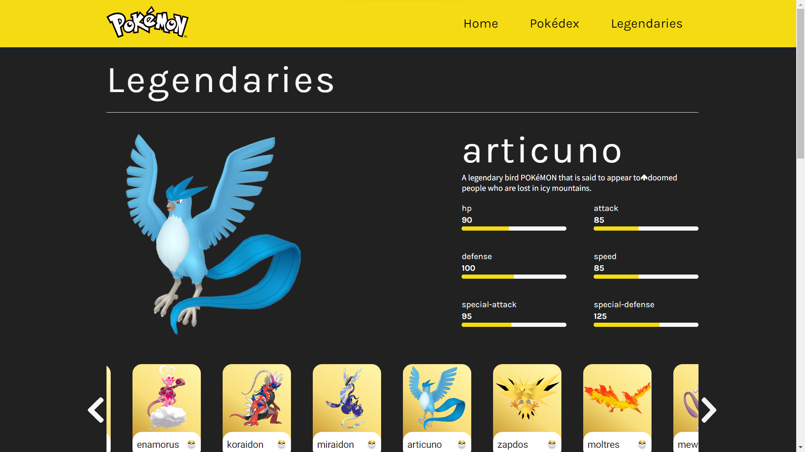
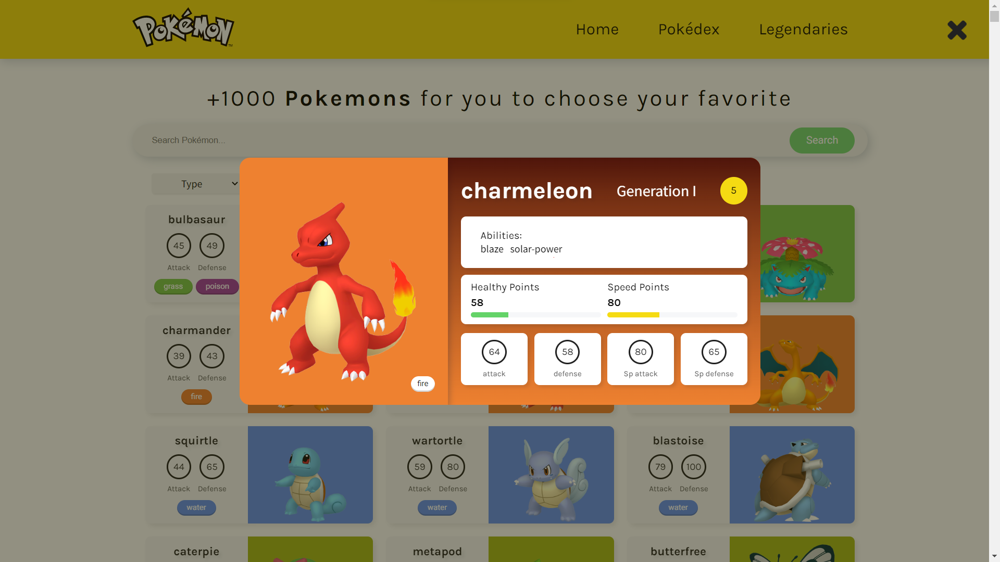

# Blog Pokémon.

Este projeto visa reproduzir uma página que consome a API PokéAPI.
O site será dividido em 4 páginas, Home, Pokédex, Legendaries e Documentation.
React, styled-components e axios são as principais tecnologias envolvidas neste projeto.

* Link do layout: https://www.figma.com/file/1EGMx3KffWUI7a0iYCn6jC/Pokedex-(Community)?t=eBXcqhP5efGu141P-0

## Home page:


A página inicial é basicamente a página de apresentação, onde o aplicativo será anunciado.
Possui um botão para direcionar o usuário para a página de pesquisa/pokedex.

## Pokédex page:


A página Pokédex é responsável por apresentar os pokémons existentes de acordo com a filtragem ou pesquisa do usuário.
Nela o usuário tem a liberdade de pesquisar o pokémon digitando o nome e filtrar por tipo, região e raridade.

## Legendaries: 



Está página cotém TODOS os pokémons lendarios da franquia divido em três blocos All, os mais fortes e os mais fracos.
Sua importancia vem devida a forte procura dos usuarios com os lendarios. Nela vai ter "cards"

## Explicações: 

* Components:

-> Esta pasta contém todos os componentes deste projeto. Todos os componentes foram criados visando o design Atomic, tornando-os o mais simples possível e fáceis de usar.

* Contexts:

-> Como o projeto possui modais para apresentar os pokemons de forma individual e com mais informações, foi necessário criar contextos para pegar as informações dos pokemons selecionados e apresentá-los no modal.



-> O modal em Questão é utilizado tanto para as opções apresentadas quanto para pesquisa individual usando o input search.

* Data:

-> Esta pasta contém as informações estáticas do projeto, por exemplo, os tipos de pokémons. Essa abordagem foi adotada para organizar e evitar repetições desnecessárias e utilizar metodos de loop do JavaScript.

```markdown
arrOptions.map((e,k)=>{
    return(
        <option key={k} value={e.key}>{e.value}</option>
    );
})
```

* Libs:

-> Essa pasta contém todos as funções utilizadas em todo o projeto, assim evitando repetições desnecessárias, por exemplo, Filtro de pokemon.

```markdown
const filterType = (pokeFileterType: string, allPokemon: pokemonAllSearch[])=>{
    const filterTypePoke = allPokemon.filter((e)=>{
        for(let i in e.types){
            if(e.types[i].type.name === pokeFileterType.toLowerCase()){
                return e.types[i].type.name === pokeFileterType;
            }
        }
    });

    return filterTypePoke;
}
```

* Pages:

-> Essa pasta contém todas as páginas desse projeto. Essas páginas são gerenciadas pelo arquivo router.tsx utilizando react-router-dom. 

```markdown
const router = createBrowserRouter([
    {
        path: "/",
        element: <Home />,
        errorElement: <Error />
    },
    {
        path: "/pokedex",
        element: <Search />,
        errorElement: <Error />
    },
    {
        path: "/legendaries",
        element: <Legendaries />,
        errorElement: <Error />
    }
]);
```

* Services:

-> Esta pasta contém os arquivos responsáveis ​​por fazer as requisições da API do pokeapi. Neste caso, possui algumas divisões para facilitar o esquema de busca para cada situação.

```markdown
import { api } from "../api";

export const getAllPokemons = async ()=>{
    const data = await api.get("/pokedex/1/");

    const resultData = data.data;

    return resultData;
}
```

* Styles:

-> Toda a estilização, usando como base styled-components, desse projeto está contido nesta pasta. A estilização foi dividida entre os componentes, pages, themes e as padronizações globais.

* Types:

-> A tipagem de todos os arquivos estão contidos nesta pasta. 

* View:

-> A utilização dos arquivos desta pasta são para formatação das informações que serão apresentadas pelos usuários.